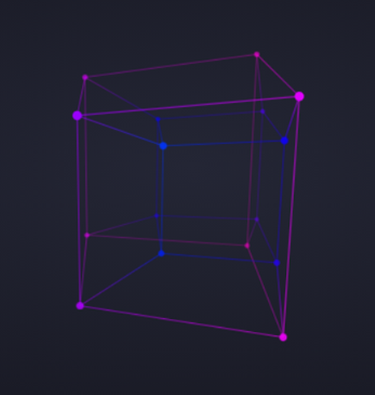
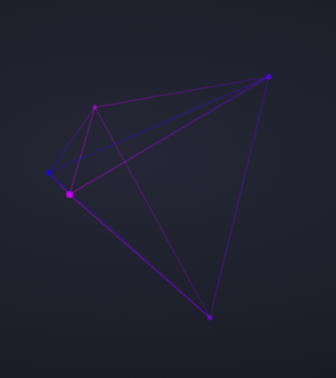
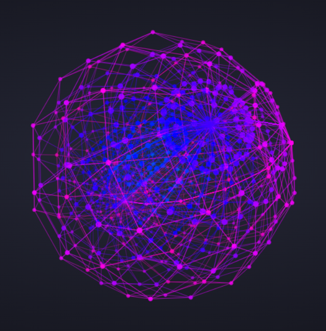
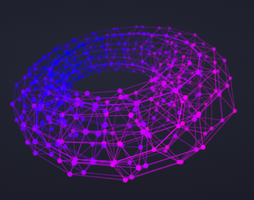
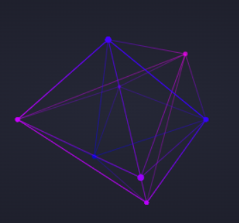

# HDchamber (Hyper-Dimensional Chamber)

## A web environment built in HTML, CSS and JS to render higher-dimensional geometries such as a Tesseract!

HDchamber is a rendering environment built in vanilla JavaScript, where geometric figures from higher dimensions are brought to life.

## Features

- Real-time rendering of hyper-dimensional geometric objects.
- Adjustable dimension count (from 2D up to 6D).
- Fully built with vanilla JavaScript. No frameworks required.

## Currently supported meshes

- **Hypercube**: the n-dimensional analog of square and cube.

  

- **Simplex**: the n-dimensional analog of equilateral triangle and regular tetrahedron.

  

- **Hypersphere**: the n-dimensional analog of circle and sphere.

  

- **Torus**: the n-dimensional analog of annulus and torus in 3D.

  

- **Orthoplex**: the n-dimensional analog of square and regular octahedron.

  

## How to Run HDchamber Locally!

Follow these steps to get started:

1. **Clone** the repository to your local machine.
2. Install [Visual Studio Code](https://code.visualstudio.com/) if you haven't already.
3. Open VS Code and press `Ctrl + Shift + X` to open the Extensions tab.
4. Search for and install **Live Server**.
5. Open the project folder in VS Code.
6. Right-click `index.html` and select **"Open with Live Server"**.
7. Done! Enjoy exploring higher dimensions!
